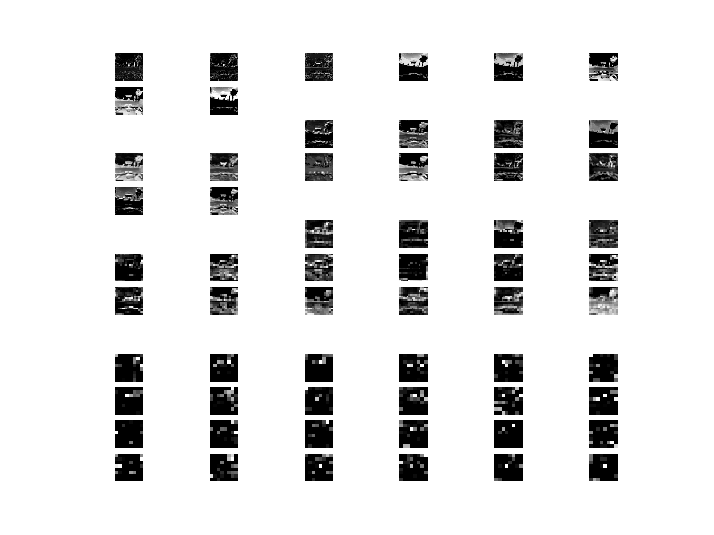

# Carputer

## Recording pipline

0. activate the virtualenv: `source /path/to/venv/bin/activate`
0. run a script to drive and record training data: `python main_car.py record` --
this will let you have manual control over the car
and save out recordings when you flip the switch

## Run autonomously

0. activate the virtualenv: `source /path/to/venv/bin/activate`
0. run a script to let tensorflow drive: `python main_car.py tf` --
when you flip the switch, you will lose manual control
and the car will attempt to drive on its own
0. for autonomous kill switch: pull throttle and turn the steering wheel
0. to revive autonomous mode, hit the channel 3 button (near the trigger)

## Training pipline

0. convert images to np arrays: `python NeuralNet/filemash.py /path/to/data`
0. train a model: `python NeuralNet/convnet02.py`
0. use this model to drive the car (see above)

## Analysis

* for training info, see `debug.html` -- reminder: < 7 is right, > 7 is left
* run `analysis/make_video.py` for debug videos
* use `analysis/plot_vs_time.py` to view telemetry data

### Hardware TODOs

- [ ] get new camera with no exposure bug
- [x] securely mount camera to car
- [x] front bumper
- [x] Roll cage

### Software TODOs

- [x] make images 320 x 240
- [x] throttle linear remap (in branch split_softmax)

### Visualizing Layer Activation (Work in progress)
You can enable the flag `visualize_layer_activations` to visualize layer activations. Right now, I am only outputing activations for the pooling layers. They are written to a file in the convnet02-restults directory under `layer_activations`

Here is an example of an output after ~5000 iterations:

